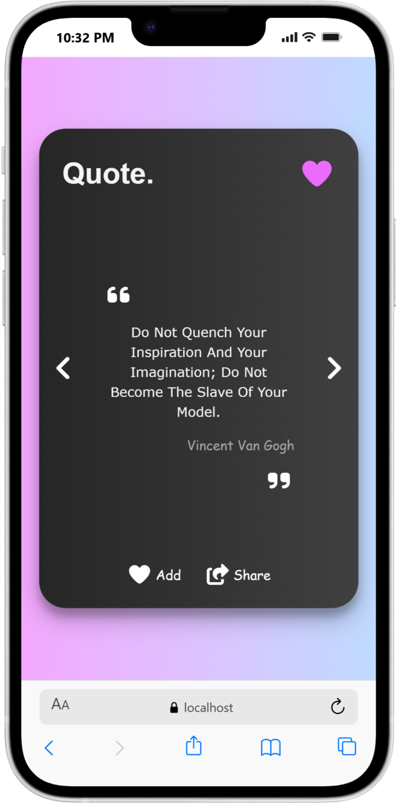
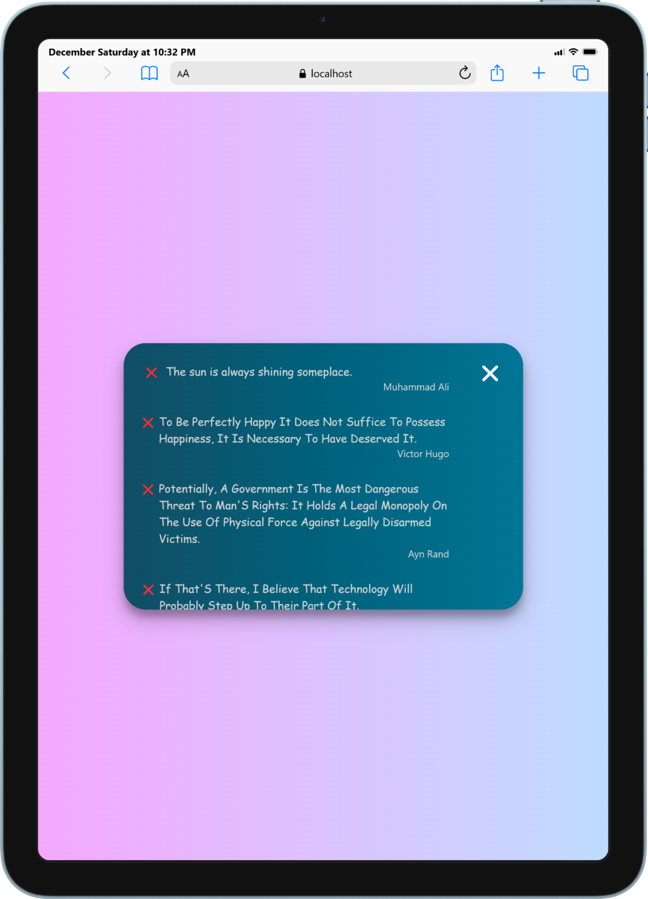
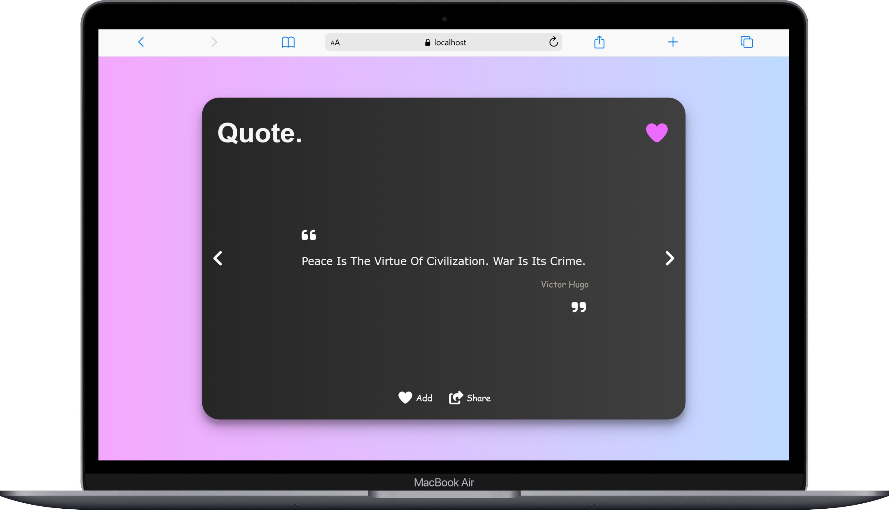

# Quotes App 

A modern React application that displays random quotes, allows users to
navigate between quotes, save favourites, and share quotes easily.

------------------------------------------------------------------------

## Features

-   Fetch random quotes from an external API
-   Navigate between next and previous quotes
-   Save and remove favourite quotes (persisted using localStorage)
-   Share quotes using the Web Share API
-   Responsive design for **mobile, tablet, and desktop**
-   Smooth UI interactions and animations

------------------------------------------------------------------------

## Technologies Used

-   React (Hooks)
-   JavaScript (ES6+)
-   Tailwind CSS
-   Font Awesome Icons
-   LocalStorage API
-   Web Share API
-   axios

------------------------------------------------------------------------

## Project Structure

    src/
    │── Components/
    │   └── MainComponent.jsx
    │
    │── Services/
    │   ├── requestApi.js
    │   └── dealWithFavourites.js
    │
    └── App.jsx

------------------------------------------------------------------------

## Application Logic

### 1️⃣ Quote Fetching

-   Quotes are fetched asynchronously from an external API.
-   A loading spinner is shown while fetching.

### 2️⃣ Session Quote Stack

-   Quotes viewed during the session are stored in a stack.
-   Enables navigation back to previously viewed quotes.

### 3️⃣ Favourites Management

-   Quotes can be added to or removed from favourites.
-   Favourites are stored in `localStorage`.
-   UI updates automatically when favourites change.

### 4️⃣ Share Functionality

-   Uses the Web Share API (if supported by the browser).
-   Allows users to share quotes directly.

------------------------------------------------------------------------

## Responsive Screenshots

### Mobile View

### Tablet View
- While opening favourites

### Desktop View

------------------------------------------------------------------------
# [" Click to open the Live Demo"](https://react-quote-generator-omega.vercel.app/)
